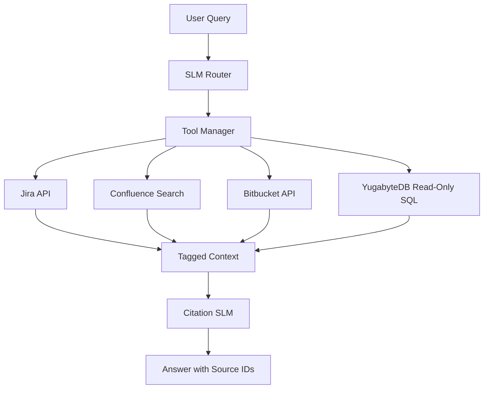

# Use Case: Federated Enterprise Search with Citations

## Summary

Use an SLM as a router and citation-aware synthesizer over multiple enterprise data sources such as Bitbucket commits, Confluence pages, Jira tickets, and YugabyteDB rows.

This is primarily a retrieval-augmented generation use case. The model should not memorize enterprise data. It should decide which source to query, produce structured tool calls, receive tagged results, and answer only from retrieved context with citations.

## Target Outcomes

- Answer questions across Jira, Confluence, Bitbucket, and YugabyteDB.
- Cite every claim with source IDs and links.
- Translate user questions into JQL, CQL, Git queries, or read-only SQL.
- Summarize incidents, releases, ownership, and historical changes.
- Avoid unsupported answers when retrieved context is incomplete.

## Example User Question

```text
Why did the payment service fail last night and who fixed it?
```

Router output:

```json
{
  "intents": [
    {"source": "jira", "query": "project = PAY AND status = Closed AND resolutiondate >= -24h"},
    {"source": "bitbucket", "query": "repo:payment-service branch:main last_commits:10"},
    {"source": "yugabyte", "query": "SELECT * FROM error_logs WHERE service = 'payment' AND timestamp >= NOW() - INTERVAL '24 hours'"}
  ]
}
```

Final answer:

```text
The payment service failed due to a NullPointerException in transaction retry handling [DB-Row-1]. The incident was tracked in Jira as PAY-500 [Jira-PAY-500]. Alice fixed it with commit a1b2, which updated retry logic [Commit-a1b2].
```

## Data Sources

- Jira issues and JQL search results
- Confluence pages and CQL search results
- Bitbucket commits, diffs, pull requests, and comments
- YugabyteDB tables and logs
- Release notes
- Ownership metadata

## Architecture



## Training Format for Router

```json
{
  "instruction": "Route this enterprise question to the correct tools and generate safe queries.",
  "input": "Show me high priority bugs in checkout that are not closed.",
  "output": "{\"intents\":[{\"source\":\"jira\",\"query\":\"project = CHK AND priority = High AND status != Closed\"}]}"
}
```

## Synthesizer Rule

The synthesizer should follow this strict behavior:

```text
Answer using only provided context chunks. Every factual claim must include a source ID in brackets. If the context does not contain the answer, say that the available sources do not answer it.
```

## Guardrails

- Use read-only service accounts.
- Validate SQL and block writes.
- Enforce source IDs on every chunk.
- Do not allow uncited claims.
- Log tool calls and source IDs for audit.
- Redact secrets before model context assembly.

## Evaluation

- Tool routing accuracy
- Query validity
- Citation coverage
- Unsupported claim rate
- Answer correctness against known incidents
- Latency per source
- Security policy pass rate

## First Milestone

Build a router dataset with 500 source-specific examples:

- Natural language to JQL
- Natural language to Confluence CQL
- Natural language to Bitbucket commit search
- Natural language to Yugabyte read-only SQL
