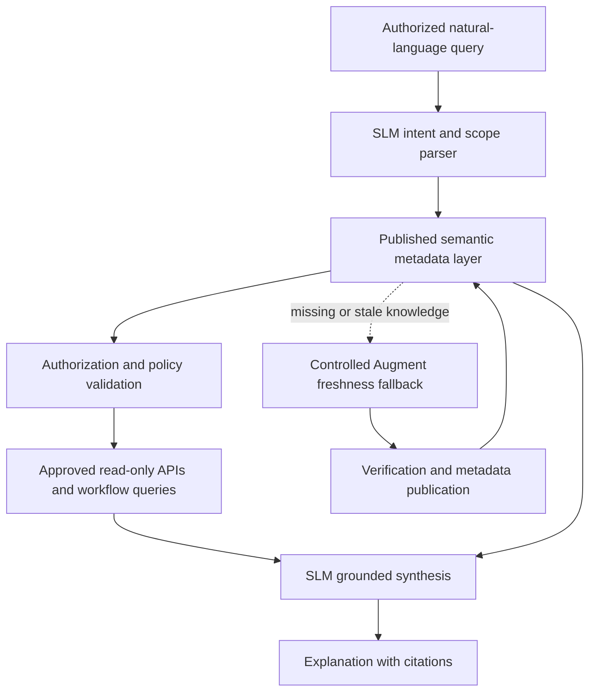
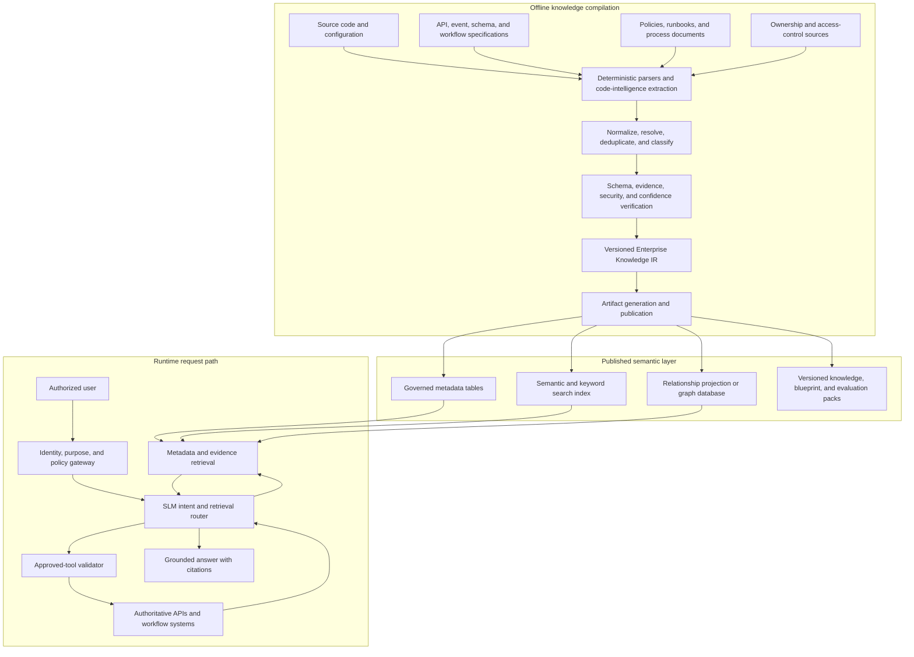

# Use Case: Offline Enterprise Knowledge Extraction for Grounded SLMs

## Summary

Build a governed enterprise knowledge layer by extracting implementation knowledge
from source code, API specifications, workflow definitions, schemas, rule engines,
policies, and operational documentation during an offline compilation process.

At runtime, a Small Language Model (SLM) queries this compact semantic layer instead
of repeatedly asking a code-intelligence system to inspect the full codebase. The SLM
uses the retrieved metadata to understand business terminology, select approved
read-only tools, explain system behavior, and cite the evidence behind its answer.

The model must not memorize live customer or transaction data. Dynamic production
facts remain in authoritative systems and are retrieved through approved APIs after
authorization and policy checks.

## Problem

Enterprise implementation knowledge is distributed across:

- service repositories
- API contracts
- workflow definitions
- event schemas
- database migrations
- decision tables and rule engines
- ownership files
- policy and process documentation
- operational runbooks

A natural-language request such as:

```text
How is the obligation ratio calculated, and which workflow uses it?
```

may require locating a service, endpoint, rule version, workflow step, data inputs,
owner, and policy reference. Querying a code-intelligence platform for every runtime
request is expensive, slow, difficult to govern, and unnecessarily exposes runtime
availability to a development-time dependency.

## Proposed Capability

Use a code-intelligence platform offline as one of several knowledge extractors. It
discovers candidate facts and relationships, but does not become a production action
executor or the final source of truth.

The offline pipeline produces:

- API catalog
- service catalog
- workflow map
- business-capability graph
- semantic glossary
- service and data lineage
- business-rule inventory
- approved runtime-tool catalog
- evidence chunks for semantic retrieval
- training and evaluation examples for task-specific SLM behavior

Runtime systems query the published knowledge layer and call only allowlisted,
policy-mediated APIs for live data.

## Can Augment Interpret Natural-Language Queries for the SLM?

Yes, provided Augment is positioned as a code-intelligence and enterprise-grounding
layer rather than a production execution engine.

The indexed enterprise codebase can give Augment deep implementation context. The
SLM contributes domain language, intent understanding, policy interpretation,
dialogue, evidence synthesis, and constrained orchestration. These are complementary
roles:

| Layer | Primary responsibility |
|---|---|
| Augment | Code retrieval, API and schema discovery, workflow tracing, rule localization, dependency analysis, and implementation grounding |
| Offline semantic layer | Governed, versioned, low-latency representation of extracted enterprise knowledge |
| SLM | Intent parsing, domain reasoning, retrieval planning, policy-aware explanation, and safe tool selection |
| Runtime systems | Authoritative customer, transaction, workflow, telemetry, and audit facts |
| Policy and orchestration | Authorization, purpose checks, approvals, action execution, and audit |

### Recommended operating model

Do not place Augment in the mandatory path of every production request. Use it:

1. **Offline**, to discover and refresh services, APIs, workflows, schemas, rules,
   dependencies, ownership candidates, and evidence.
2. **During review**, to investigate conflicts or low-confidence extractions.
3. **As a controlled freshness fallback**, when the published semantic layer does
   not cover a newly deployed implementation and the caller is authorized for
   developer-level evidence.

The normal runtime path is:



This preserves the value of the indexed codebase while reducing repeated Augment
calls, runtime coupling, cost, and latency.

### Why the indexed codebase is valuable

Large enterprises have accumulated operational semantics in:

- Java services and monoliths
- stored procedures and database migrations
- Kafka producers and consumers
- Temporal-style workflows and saga definitions
- rule engines and decision tables
- API contracts and DTOs
- legacy and core-system integrations
- exception handling, retries, and compensations

This implementation knowledge often explains how the business actually operates,
including details missing from formal documentation. Augment can help turn a request
such as:

```text
Show me why customer pricing changed.
```

into candidate implementation context:

```text
pricing-service
relationship-engine
profitability-service
campaign-engine
risk-adjustment-rule
```

Those candidates still require evidence, version, ownership, confidence, and
authorization metadata before publication or use in an answer.

### Example: operational failure diagnosis

For a question such as:

```text
Why did repayment bounce handling fail?
```

Augment may identify:

- the relevant Kafka topic
- the consumer service
- the workflow and failed state
- retry and timeout configuration
- exception-handling code
- the downstream dependency

The semantic layer stores the verified mapping and citations. At runtime, approved
systems provide the current workflow state and telemetry. The SLM combines the
authorized evidence into an operational explanation without exposing raw source code
to an ordinary end user.

### Example: decision explanation

For a question such as:

```text
Why was a foreclosure request rejected for this case?
```

The responsibilities remain separate:

1. The SLM identifies the intent: foreclosure, rejection explanation, and
   case-specific data.
2. The semantic layer supplies the verified service, eligibility calculator, penalty
   rule, cooling-period policy, and approval workflow.
3. Approved runtime APIs retrieve the case state, repayment history, request,
   applicable policy version, and workflow trace.
4. The policy layer filters fields and confirms the user may access the case.
5. The SLM produces the business reason, operational reason, policy basis, citations,
   and permitted remediation guidance.

The SLM must not invent implementation details or case facts. If either the verified
knowledge or authorized runtime data is unavailable, it abstains.

### Where Augment is especially useful

1. **Hidden business-logic discovery**
   Locate where a rule is implemented, which service computes a value, and which
   workflow consumes the result.

2. **Legacy-system interpretation**
   Trace behavior across monoliths, large Java repositories, microservice sprawl,
   event ecosystems, stored procedures, and core-system adapters.

3. **API discovery**
   Identify the service, operation, DTOs, schemas, authentication requirements, and
   calling relationships for a business capability.

4. **Workflow reasoning**
   Discover states, transitions, retry semantics, timeouts, compensations, saga
   patterns, event triggers, and downstream dependencies.

5. **Impact analysis**
   Identify which services, workflows, policies, tests, and operational consumers may
   be affected by a rule or contract change.

### Why Augment does not replace the SLM

Augment is not the final layer for:

- domain conversation and terminology
- policy and regulatory interpretation
- nuanced, audience-appropriate explanation
- multi-source synthesis
- dialogue state and clarification
- structured runtime-tool selection
- abstention and disclosure behavior

The SLM should learn these stable behaviors while relying on retrieved evidence for
implementation facts.

### Execution boundary

Augment must not directly execute production actions or generated SQL. Execution
occurs only through:

- allowlisted APIs and workflow operations
- current identity and purpose authorization
- schema-validated tool arguments
- policy checks
- user confirmation or maker-checker approval where required
- rate limits, timeouts, and audit logging
- deterministic workflow engines, API gateways, or event producers

Without this boundary, generated actions can create hallucinated operations,
privilege escalation, data exposure, and audit failures.

### Mature capability

The mature architecture combines:

```text
Enterprise assistant
  + offline and fallback code intelligence
  + governed semantic metadata
  + authorized runtime data
  + workflow orchestration
  + policy engines
  + SLM reasoning
```

It can then support decision explanation, operational diagnosis, workflow tracing,
enterprise knowledge retrieval, controlled automation, developer assistance, and
customer servicing while continuing to treat deterministic enterprise systems as the
source of truth.

## Target Outcomes

- Resolve business terms to services, APIs, workflows, events, and rules.
- Answer implementation and operational questions with source citations.
- Route requests to approved read-only tools without generating arbitrary code.
- Explain which rule version and evidence support a decision.
- Reduce repeated code-intelligence calls and runtime latency.
- Detect stale metadata when source code or policies change.
- Keep live production facts outside model weights and training datasets.
- Preserve source-to-artifact-to-model lineage for audit and reproducibility.

## Non-Goals

- Giving a code assistant direct production access.
- Executing generated SQL, shell commands, or API calls without validation.
- Training the SLM on customer PII, account balances, or live transactions.
- Replacing authoritative policy engines, workflow engines, or systems of record.
- Treating embeddings as the canonical representation of enterprise knowledge.
- Exposing raw source code or internal implementation details to unauthorized users.

## Representative Scenario

### Business concept

```yaml
concept: obligation_ratio
display_name: Fixed obligation to income ratio
definition: Ratio of recurring monthly obligations to verified monthly income
capability: credit_eligibility_assessment
```

### Implementation mapping

```yaml
service: underwriting-risk-service
api: /risk/foir
workflow: retail-underwriting-v3
rule: foir-eligibility-v7
owner: credit-risk-team
```

### User question

```text
Which service calculates the obligation ratio, what inputs does it use, and where is
the result consumed?
```

### Expected runtime behavior

1. Resolve "obligation ratio" to the canonical business concept.
2. Retrieve its service, API, rule, workflow, and lineage relationships.
3. Filter results by the user's authorization and disclosure policy.
4. Return an explanation with evidence references and metadata freshness.
5. If live case data is requested, call an approved read-only API only after policy
   validation; do not reuse code-intelligence access for production retrieval.

## Architecture



## Offline Knowledge Compilation

### Source priority

Use deterministic sources before model-inferred sources:

1. API specifications, schemas, workflow definitions, manifests, and ownership files
2. parsable source-code symbols, annotations, call references, and configuration
3. rule tables, policy documents, and approved process documentation
4. code-intelligence inferences and generated summaries
5. human review and stewardship decisions

An inferred fact must never silently override a deterministic fact. Conflicts are
published as review items with both evidence records attached.

### Compilation stages

```text
knowledge sources
  -> extraction
  -> normalization
  -> entity resolution
  -> relationship resolution
  -> security classification
  -> evidence verification
  -> Enterprise Knowledge IR
  -> metadata, search, graph, training, and evaluation artifacts
```

### Refresh triggers

- merge to a monitored repository branch
- release tag or deployment
- API or schema contract change
- workflow or rule publication
- policy-document version change
- ownership or classification change
- scheduled full reconciliation

Incremental refresh should be the normal path. A full rebuild remains available for
recovery and reproducibility.

## What to Store in Metadata

Store facts and relationships that help a runtime system answer five questions:

1. **What is it?**
2. **Where is it implemented?**
3. **How is it connected?**
4. **Who owns and may access it?**
5. **Why should this fact be trusted, and how fresh is it?**

### 1. Identity and classification

| Field | Purpose |
|---|---|
| `entity_id` | Stable, globally unique identifier |
| `entity_type` | Service, API, workflow, rule, capability, event, schema, field, document, tool, or team |
| `canonical_name` | Normalized machine-facing name |
| `display_name` | Human-readable name |
| `description` | Concise, reviewed semantic description |
| `domain` and `subdomain` | Business taxonomy |
| `capability_ids` | Business capabilities implemented or supported |
| `aliases` and `acronyms` | Natural-language resolution terms |
| `lifecycle_status` | Proposed, active, deprecated, retired, or unknown |
| `environment_scope` | Development, test, staging, production, or shared |
| `tags` | Additional governed classifications |

### 2. Technical contract

| Field | Purpose |
|---|---|
| `repository_ref` | Repository identifier without embedded credentials |
| `source_path` | Evidence path, subject to disclosure policy |
| `source_symbol` | Class, method, function, rule, or configuration symbol |
| `api_protocol` | REST, GraphQL, gRPC, event, batch, or internal |
| `api_method` and `api_route` | Stable API operation identity |
| `request_schema_ref` | Versioned request contract |
| `response_schema_ref` | Versioned response contract |
| `event_topics` | Produced or consumed event contracts |
| `workflow_id` and `workflow_step` | Orchestration mapping |
| `runtime_tool_id` | Allowlisted runtime tool, if one exists |
| `timeout_class` and `data_freshness_sla` | Runtime expectations, not live values |

Do not store secrets, tokens, connection strings, or raw production payloads.

### 3. Business semantics and rules

| Field | Purpose |
|---|---|
| `business_definition` | Reviewed meaning of the entity or value |
| `input_concepts` | Canonical business inputs |
| `output_concepts` | Canonical outputs |
| `units` and `value_constraints` | Interpretation and validation |
| `rule_id` and `rule_version` | Stable rule identity and version |
| `rule_expression_summary` | Human-readable summary; not a replacement for the rule engine |
| `effective_from` and `effective_to` | Temporal validity |
| `policy_refs` | Governing policy or regulation references |
| `exception_refs` | Known exception and override paths |
| `decision_outcomes` | Possible governed outcomes |

### 4. Relationships and lineage

Represent relationships as typed, directed edges:

| Edge type | Example |
|---|---|
| `IMPLEMENTS` | service implements capability |
| `EXPOSES` | service exposes API |
| `INVOKES` | workflow step invokes API |
| `PRODUCES` / `CONSUMES` | service produces or consumes event |
| `READS_FROM` / `WRITES_TO` | service accesses governed data asset |
| `COMPUTES` | rule computes business concept |
| `GOVERNED_BY` | rule or API is governed by policy |
| `OWNED_BY` | entity is owned by team |
| `SUPERSEDES` | new version supersedes old version |
| `EVIDENCED_BY` | fact or edge is supported by source evidence |
| `AVAILABLE_AS_TOOL` | API has an approved runtime-tool definition |

Each edge should contain `valid_from`, `valid_to`, provenance, confidence, and
security classification. This makes the graph temporal and auditable.

### 5. Ownership, security, and runtime policy

| Field | Purpose |
|---|---|
| `owner_team_id` | Accountable team |
| `steward_id` | Metadata review responsibility |
| `data_classification` | Public, internal, confidential, restricted, or organization-specific levels |
| `contains_sensitive_data` | PII, financial, authentication, health, or other regulated categories |
| `permitted_roles` | Coarse discovery policy |
| `purpose_tags` | Allowed business purposes |
| `disclosure_policy_id` | Controls fields and evidence shown to a caller |
| `tool_policy_id` | Controls whether and how a tool may be invoked |
| `approval_requirement` | None, user confirmation, maker-checker, or manual approval |
| `allowed_operations` | Usually read-only for this use case |
| `audit_category` | Required logging and retention class |

Runtime authorization must still be evaluated against the current identity and
authoritative policy system. Metadata is not a substitute for authorization.

### 6. Provenance, confidence, and freshness

| Field | Purpose |
|---|---|
| `source_type` | Specification, code, configuration, document, inferred, or human-reviewed |
| `source_uri` | Stable evidence locator |
| `source_revision` | Commit, tag, document version, or content hash |
| `source_excerpt_hash` | Detects changed evidence without storing sensitive text |
| `extractor_id` and `extractor_version` | Reproducible extraction |
| `extracted_at` | Compilation timestamp |
| `last_verified_at` | Most recent successful verification |
| `confidence` | Calibrated extraction confidence |
| `verification_status` | Verified, inferred, conflicting, stale, or rejected |
| `reviewer` and `reviewed_at` | Human stewardship trail |
| `knowledge_release` | Immutable publication version |

### 7. Retrieval metadata

Keep retrieval text separate from canonical facts:

| Field | Purpose |
|---|---|
| `chunk_id` | Stable evidence-chunk identifier |
| `entity_ids` | Entities described by the chunk |
| `retrieval_text` | Sanitized text suitable for model context |
| `keywords` | Exact identifiers and important terms |
| `embedding_model_id` | Embedding model and version |
| `embedding_version` | Supports safe re-indexing |
| `language` | Retrieval and generation language |
| `security_filter_keys` | Mandatory pre-retrieval filters |
| `citation_label` | Stable label returned in grounded answers |

Embeddings are derived artifacts. The canonical text, entity records, relationships,
and evidence provenance must remain independently retrievable.

## Canonical Record Example

```json
{
  "entity_id": "concept:credit:obligation_ratio",
  "entity_type": "business_concept",
  "canonical_name": "obligation_ratio",
  "display_name": "Fixed obligation to income ratio",
  "domain": "credit",
  "capability_ids": ["capability:credit_eligibility_assessment"],
  "aliases": ["FOIR", "fixed obligation ratio"],
  "lifecycle_status": "active",
  "owner_team_id": "team:credit-risk",
  "data_classification": "internal",
  "source": {
    "source_type": "api_specification",
    "source_uri": "repo://risk-platform/openapi/risk.yaml",
    "source_revision": "commit-sha-256",
    "extractor_id": "openapi-parser",
    "extractor_version": "1.0.0",
    "extracted_at": "2026-07-29T00:00:00Z"
  },
  "verification": {
    "status": "verified",
    "confidence": 0.99,
    "last_verified_at": "2026-07-29T00:00:00Z"
  },
  "knowledge_release": "enterprise-credit-2026.07.29.1"
}
```

Example relationships:

```json
[
  {
    "subject_id": "service:underwriting-risk-service",
    "predicate": "EXPOSES",
    "object_id": "api:underwriting-risk-service:post-risk-foir",
    "valid_from": "2026-04-01",
    "evidence_id": "evidence:openapi:risk:foir",
    "confidence": 1.0
  },
  {
    "subject_id": "rule:foir-eligibility-v7",
    "predicate": "COMPUTES",
    "object_id": "concept:credit:obligation_ratio",
    "valid_from": "2026-04-01",
    "evidence_id": "evidence:rules:foir-v7",
    "confidence": 1.0
  },
  {
    "subject_id": "workflow:retail-underwriting-v3",
    "predicate": "INVOKES",
    "object_id": "api:underwriting-risk-service:post-risk-foir",
    "valid_from": "2026-04-01",
    "evidence_id": "evidence:workflow:retail-underwriting-v3",
    "confidence": 0.98
  }
]
```

## Can Databricks Be the Store?

Yes. Databricks can be the primary governed storage and publication platform for
this use case, especially when it is already an approved enterprise data platform.
It should be treated as a set of complementary storage and serving capabilities,
not as one undifferentiated "metadata database."

### Recommended Databricks mapping

| Need | Databricks role |
|---|---|
| Canonical entities and facts | Delta tables governed by Unity Catalog |
| Typed relationships | Delta edge tables with temporal validity |
| Evidence and sanitized chunks | Delta tables or governed volumes |
| Semantic and hybrid retrieval | Databricks AI Search indexes synchronized from Delta |
| Governance | Unity Catalog permissions, tags, audit, and lineage |
| Offline extraction and refresh | Versioned jobs and pipelines |
| Training/evaluation lineage | MLflow plus immutable dataset and pack versions |
| Runtime access | Narrow read APIs, SQL functions, or retrieval services behind an authorization gateway |

### Suggested logical tables

```text
enterprise_knowledge.entities
enterprise_knowledge.relationships
enterprise_knowledge.evidence
enterprise_knowledge.business_rules
enterprise_knowledge.api_operations
enterprise_knowledge.workflow_steps
enterprise_knowledge.runtime_tools
enterprise_knowledge.retrieval_chunks
enterprise_knowledge.extraction_runs
enterprise_knowledge.review_queue
enterprise_knowledge.knowledge_releases
```

Use stable IDs and release identifiers across all tables. Publish a knowledge release
atomically so a runtime request never mixes incompatible entity, edge, evidence, and
embedding versions.

### When Databricks alone is sufficient

Start with Databricks alone when:

- most access is filtered lookup, semantic retrieval, aggregation, and one- or
  two-hop relationship traversal
- offline refresh throughput matters more than millisecond graph traversal
- the organization benefits from a single governance and lineage plane
- Delta tables are already the standard durable store
- graph projections can be computed in batch or served as denormalized views

This is the recommended Phase 1 choice because it minimizes operational complexity.

### When to add a graph database

Add a dedicated graph serving projection when runtime workloads require:

- unpredictable multi-hop traversal
- path finding across many relationship types
- dependency blast-radius analysis with strict interactive latency
- graph algorithms or neighborhood expansion at high concurrency
- graph-native authorization or query semantics

The canonical entities and edges can remain in governed Delta tables. Publish a
versioned projection to the graph store and retain the same IDs, evidence references,
and knowledge-release identifier. Do not create two competing sources of truth.

### Important Databricks limitations to plan for

- Platform lineage mainly describes data and AI assets; it does not automatically
  represent every application-level service, API, workflow, and business-rule edge.
  Those relationships still need explicit knowledge tables.
- External lineage helps connect off-platform assets, but it is not a complete
  business-capability graph.
- A vector index is a retrieval accelerator, not a canonical metadata store.
- Runtime policy enforcement must occur before retrieval and again before tool
  execution; catalog permissions alone do not express every end-user purpose rule.
- Very low-latency, deeply connected graph queries may warrant a separate serving
  database.

## SLM Responsibilities

The SLM should learn stable task behavior, not enterprise facts.

### Train or adapt the SLM to

- classify request intent
- resolve aliases to canonical entity types
- produce a constrained metadata-retrieval plan
- choose from an allowlisted tool catalog
- ask for missing required parameters
- synthesize an answer from retrieved evidence
- cite every implementation-specific claim
- distinguish static implementation knowledge from live production data
- abstain when evidence is missing, stale, conflicting, or unauthorized
- explain decisions in business language without exposing restricted code

### Retrieve at runtime

- current entity and relationship records
- current rule and policy versions
- current ownership and tool availability
- sanitized evidence chunks
- live customer, transaction, workflow, and telemetry data through approved APIs

### Do not put in training data

- customer records or transaction history
- credentials, secrets, or connection details
- raw production payloads
- access tokens or authorization decisions
- large source-code dumps
- facts expected to change with every release

## Training Dataset Families

### 1. Intent and scope classification

```json
{
  "instruction": "Classify the enterprise request.",
  "input": "Which workflow uses the obligation-ratio decision?",
  "output": {
    "intent": "implementation_discovery",
    "required_entities": ["business_concept", "workflow", "rule"],
    "requires_live_data": false
  }
}
```

### 2. Constrained retrieval planning

```json
{
  "instruction": "Produce a metadata retrieval plan using only the allowed operations.",
  "input": "Where is the obligation ratio calculated and who owns it?",
  "context": {
    "allowed_operations": ["resolve_entity", "get_neighbors", "get_evidence"],
    "allowed_edge_types": ["COMPUTES", "OWNED_BY", "EVIDENCED_BY"]
  },
  "output": {
    "steps": [
      {
        "operation": "resolve_entity",
        "query": "obligation ratio",
        "entity_type": "business_concept"
      },
      {
        "operation": "get_neighbors",
        "direction": "incoming",
        "edge_types": ["COMPUTES", "OWNED_BY"]
      },
      {
        "operation": "get_evidence",
        "minimum_verification_status": "verified"
      }
    ]
  }
}
```

### 3. Grounded synthesis with citations

```json
{
  "instruction": "Answer only from the authorized evidence. Cite every factual claim.",
  "input": "Which service calculates the obligation ratio?",
  "context": [
    {
      "citation": "API-RISK-FOIR-17",
      "text": "The POST /risk/foir operation is exposed by underwriting-risk-service."
    }
  ],
  "output": "The obligation ratio is calculated through POST /risk/foir in underwriting-risk-service [API-RISK-FOIR-17]."
}
```

### 4. Abstention and conflict handling

Include examples for:

- no matching entity
- stale evidence
- conflicting code and specification
- unauthorized evidence
- missing rule version
- deprecated API
- live-data request without an approved tool
- request that would require a write action

### 5. Safe tool routing

The target is a typed tool call, never generated executable code:

```json
{
  "tool": "get_credit_assessment_summary",
  "arguments": {
    "case_id": "CASE-REFERENCE"
  },
  "purpose": "case_explanation",
  "mode": "read_only"
}
```

## Knowledge and Training Artifacts

This use case should compile into the framework's four artifact types:

### Knowledge Pack

- versioned Enterprise Knowledge IR
- canonical entities and typed relationships
- evidence and provenance records
- security classifications
- retrieval chunks and embedding manifest
- knowledge-release manifest

### Blueprint Pack

- intent and entity schemas
- allowed retrieval operations
- tool-call schemas
- grounding and citation prompt
- abstention and conflict policies
- disclosure policy references

### Adapter Pack

- task-specific PEFT adapter, if evaluation proves adaptation is needed
- tokenizer and prompt-template compatibility
- training dataset manifest
- base-model and training lineage
- evaluation results

### Runtime Pack

- metadata backend configuration
- search-index references
- optional graph projection configuration
- approved-tool catalog
- authorization and policy hooks
- output validators
- latency, freshness, and fallback settings

## Runtime Contract

The model emits a structured request:

```json
{
  "intent": "implementation_discovery",
  "entities": [
    {
      "type": "business_concept",
      "query": "obligation ratio"
    }
  ],
  "relationship_types": ["COMPUTES", "INVOKES", "OWNED_BY"],
  "evidence_policy": {
    "minimum_status": "verified",
    "citations_required": true
  },
  "requires_live_data": false
}
```

The retrieval service, not the SLM, applies:

- caller identity
- role and purpose restrictions
- row and field filtering
- knowledge-release selection
- freshness policy
- evidence redaction
- result limits

## Guardrails

- Treat extracted code-intelligence output as untrusted until verified.
- Prefer deterministic parsing for contracts, schemas, and workflow definitions.
- Allow only registered, typed runtime tools.
- Prohibit arbitrary SQL, code, shell, URL, and endpoint generation at runtime.
- Use read-only credentials for discovery and diagnostic queries.
- Apply identity and purpose policy before retrieval.
- Apply action policy again before any tool invocation.
- Redact secrets and restricted code before indexing or prompt construction.
- Require citations for implementation-specific claims.
- Mark inferred, stale, and conflicting facts explicitly.
- Log retrieval IDs, tool calls, policy decisions, model version, and knowledge release.
- Keep dynamic production data out of model weights and durable prompts.
- Require human approval for any state-changing workflow.

## Evaluation

### Offline knowledge quality

- entity extraction precision and recall
- relationship extraction precision and recall
- duplicate entity rate
- unresolved-reference rate
- deterministic-to-inferred conflict rate
- owner and policy coverage
- evidence coverage
- stale metadata detection time

### SLM behavior

- intent accuracy
- entity resolution accuracy
- retrieval-plan validity
- allowlisted-tool selection accuracy
- citation coverage
- grounded-answer correctness
- unsupported claim rate
- abstention precision and recall
- sensitive-information disclosure rate
- prompt-injection resistance

### Runtime system

- retrieval relevance at fixed `k`
- authorization and policy pass rate
- p50/p95 latency
- knowledge-release consistency
- index freshness lag
- production-system call reduction
- code-intelligence call reduction
- cost per answered request

## Acceptance Criteria

- At least 95% of published high-risk facts have deterministic or human-reviewed
  evidence.
- Every published fact and relationship has a source revision and knowledge release.
- Every implementation-specific answer has citations.
- No runtime path can execute arbitrary generated SQL or code.
- Unauthorized metadata is filtered before it reaches the model.
- The system abstains when verified evidence is absent or conflicting.
- A source change is reflected in the semantic layer within the agreed freshness SLA.
- Rebuilding the same source revision with the same extractor versions produces the
  same canonical IR.
- A model or answer can be traced to its dataset, knowledge release, base model,
  adapter, prompt, and runtime configuration.

## Phased Delivery

### Phase 1: Offline extraction and Databricks publication

- Define the Enterprise Knowledge IR schema.
- Parse API specifications, workflows, rules, ownership, and source symbols.
- Publish canonical entities, relationships, evidence, and retrieval chunks to
  governed Delta tables.
- Build semantic and keyword retrieval indexes.
- Add verification, conflict detection, and review queues.
- Prove the representative obligation-ratio scenario end to end without fine-tuning.

### Phase 2: SLM routing and grounded synthesis

- Generate intent, retrieval-planning, citation, abstention, and safe-tool datasets.
- Benchmark blueprint prompting before training.
- Train a PEFT adapter only where prompting does not meet the quality threshold.
- Package validators and evaluation results with the adapter.

### Phase 3: Approved live-data tools

- Register read-only runtime tools.
- Add identity, purpose, and field-level policy mediation.
- Combine static knowledge evidence with authorized live data.
- Add full audit and operational telemetry.

### Phase 4: Graph serving projection, if justified

- Benchmark real multi-hop workloads on Delta-based relationship tables.
- Introduce a graph database only if measured latency or traversal requirements
  justify the added operating model.
- Keep governed Delta records as canonical and publish a versioned graph projection.

## First Milestone

Create a small, reviewed knowledge release containing:

- 25 business concepts
- 20 services
- 50 API operations
- 10 workflows
- 30 rules
- typed ownership, policy, and evidence relationships
- 100 retrieval and grounded-answer evaluation questions

Success means the SLM can answer the representative implementation-discovery
questions with citations, safely abstain on missing evidence, and route any live-data
request only to an approved read-only tool.

## Databricks References

- [Unity Catalog overview](https://docs.databricks.com/aws/en/data-governance/unity-catalog/)
- [Unity Catalog data lineage](https://docs.databricks.com/aws/en/data-governance/unity-catalog/data-lineage)
- [External lineage](https://docs.databricks.com/aws/en/data-governance/unity-catalog/external-lineage)
- [Databricks AI Search](https://docs.databricks.com/aws/en/vector-search/vector-search)
- [Create AI Search endpoints and indexes](https://docs.databricks.com/aws/en/vector-search/create-vector-search)
- [Graph and network analysis on Databricks](https://docs.databricks.com/aws/en/machine-learning/graph-analysis)
